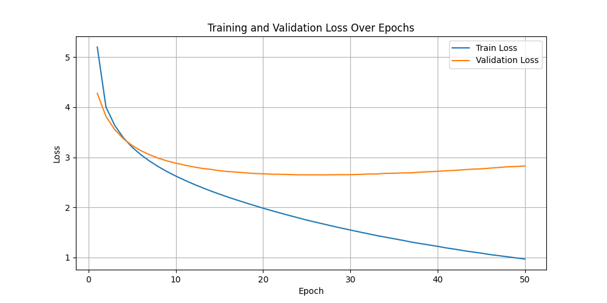

# Image Captioning with Resnet101 and LSTM with Attention

This project implements an image captioning system using a ResNet-101-based encoder, LSTM with attention mechanism as decoder. The system generates natural language captions for images from the Flickr8k dataset.

---

## Features

- **Encoder**: ResNet-101 pre-trained on ImageNet, modified to output spatial features for attention.
- **Attention Mechanism**: Focuses on relevant image regions while generating captions.
- **Decoder**: LSTM with attention for generating sequential captions.
- **Learning Curve**: Visualizes training and testing loss over epochs.
- **Dataset Splitting**: Automatically splits data into training and testing sets.

---

## Dataset

The model uses the **Flickr8k dataset**, which contains 8,000 images with five captions per image.

- **Images**: Stored in the `Flickr8k/Images/` directory.
- **Captions**: Stored in the `Flickr8k/Flickr8k.token.txt` file.

You can download the dataset from [Flickr8k Dataset](https://www.kaggle.com/datasets/snehasaarla/flickr-8k-dataset).

You can download the weight from [Drive](https://drive.google.com/drive/folders/1MmmmnKt6jq8McFxvuv_X-cAXD2Xa-IQx?usp=sharing).

---

## Installation

### Prerequisites

Ensure the following are installed:

- **Python**: Version 3.7 or later.
- **Dependencies**: Install via `requirements.txt`.

Install the dependencies:


`bash
pip install -r requirements.txt`


## Training the Model
- **Place the Dataset:** Ensure that the images are located in Flickr8k/Images/ and captions in Flickr8k/Flickr8k.token.txt.

- **Run the Training Script:** Execute the command:
`bash
python image_captioning_train.py`

## The script will:

 - Train the encoder and decoder models.
 - Save the trained models as `encoder_resnet101_attention-test.ckpt` and `decoder_resnet101_attention-test.ckpt.`
 - Generate a learning_curve.png file showing the training/testing loss over epochs.

## Outputs
### Trained Models:
 - `encoder_resnet101_attention-test.ckpt`
 - `decoder_resnet101_attention-test.ckpt`


### Learning Curve:
 - A plot of training and testing loss, saved as `learning_curve.png.`


## Dependencies
The project requires the following dependencies. They are included in the requirements.txt file:
```torch>=1.12.0
torchvision>=0.13.0
transformers>=4.28.0
Pillow>=9.0.0
matplotlib>=3.5.0
numpy>=1.21.0
nltk

